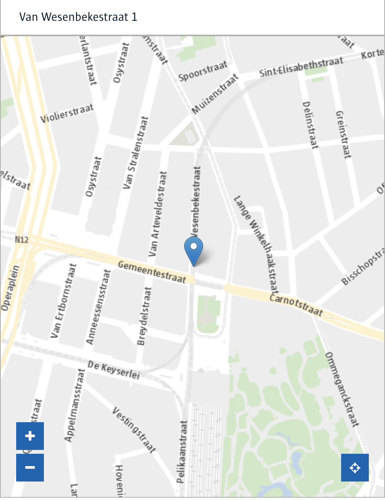

# Location Picker with Leaflet Smart Widget UI (Angular)

This is the Angular 5+ UI for a Smart Widget implementing a picker field to choose a location (street, address or point of interest) in combination with Leaflet. It is matched by a [corresponding back-end service](https://github.com/digipolisantwerp/location-picker_service_nodejs) which is needed when running it in remote mode. A default implementation for selecting locations in Antwerp is provided.



There is a demo app, see below for instructions on running it.

## How to use

### Installing

Copy the .npmrc file from this repo to your local repo to set up the link to nexusrepo.antwerpen.be npm repository.

Then install (you will need to be connected to the Digipolis network):

```sh
> npm install @acpaas-ui-widgets/ngx-location-picker
```

You may also need to install peer dependencies:

```sh
> npm install @acpaas-ui-widgets/ngx-location-picker @acpaas-ui/flyout @acpaas-ui/flyout @acpaas-ui/leaflet @acpaas-ui/mask @acpaas-ui/selectable-list @angular/platform-server
```

### Using

A BFF service should be running (see demo app instructions below for how to start one).

Import the component in your module:

```ts
import { LocationPickerLeafletModule } from '@acpaas-ui-widgets/ngx-location-picker-leaflet';

@NgModule({
  imports: [
    ...,
    LocationPickerLeafletModule
  ],
  ...
})
```

In the index.html, include the core branding stylesheet:

```html
<link rel="stylesheet" href="https://cdn.antwerpen.be/core_branding_scss/2.0.1/main.min.css">
```

In your template:

```html
<aui-location-picker-leaflet class="widget"
    [coordinatesTrigger]="triggerNoSubject"
    [coordinatesTriggerSubject]="trigger"
    [locationApiHost]="http://localhost:9999/api/locations"
    (locationChange)="addressResolvedCallback($event)"
></aui-location-picker-leaflet>
```

(Replace the url of the BFF service.)

In the component code:

```ts
class YourComponent {
    addressResolvedCallback = (location) => {
        console.log(location);
    };
    ...
}
```

Every value in the backing list must have a unique id.

Required attributes:

- **locationPickerUrl**: (string) the URL of the back-end service feeding this widget

Optional attributes:

- **coordinatesTriggerSubject**: (BehaviorSubject({ lat: number, lng: number })) can be used to trigger an external location change
- **coordinatesTrigger**: (Object({ lat: number, lng: number })) when set will retrieve location by coordinates
- **locationPickerEndpoint**: (string) when /api/location is not default endpoint
- **coordinatesEndpoint**: (string) when /api/coordinates is not default endpoint

Events:

- **locationChange**: locationItem model that is triggered when the current value is changed (or cleared)
- **mapLocationChange**: a [number,number] object with the marker position that is triggered each time the map moves

The backing service implements the following protocol:

- GET /path/to/endpoint?search=...&types=...
- search = the text that the user typed on which to match
- types = a comma-separated list of types to return, default value = "street,number,poi"
- result = JSON-encoded array of [LocationPickerValue](src/location-picker/location-picker.types.ts) objects

## Run the demo app

Set up the .npmrc (see above), then run:

```sh
> npm install
> npm start
```

Browse to [localhost:4200](http://localhost:4200)

You will also need to run [the backing service](https://github.com/digipolisantwerp/location-picker_service_nodejs).

## Contributing

We welcome your bug reports and pull requests.

Please see our [contribution guide](CONTRIBUTING.md).

## License

This project is published under the [MIT license](LICENSE.md).
